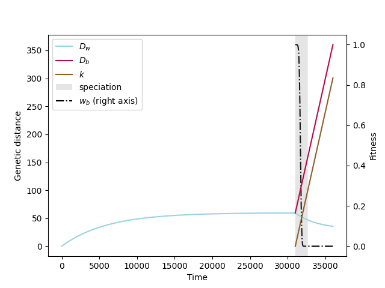

Model of speciation under the Holey Adaptive Landscape (HAL).

Gavrilets, S. (1999). A Dynamical Theory of Speciation on Holey Adaptive Landscapes. _The American Naturalist_, **154**(1), 1–22. doi: [10.1086/303217](https://doi.org/10.1086/303217)

# Summary 
This is a modelling tool for the speciation dynamics under an assumption of reproductive isolation based on the genetic distance between individuals. 

# Authors
**Pierre Veron<sup>1,2,#</sup>, Agathe Chave<sup>1</sup>, Anaïs Spire<sup>1</sup>**

<sup>1</sup>Institut de biologie de l'École normale supérieure, Paris, France

<sup>2</sup>Écologie Société et Évolution, Université Paris-Saclay, France

<sup>#</sup>Contact `pveron` at `bio.ens.psl` dot `eu`

# General
This repository allows to run deterministic predictions deriving from Gavrilets (1999) to calculate the speciation dynamics between two populations after a split. The main assumption is that, individuals are fertile if their genetic distance is smaller than a threshold for outbreeding depression called $K$.

3 variations of the model are implemented:
* neutral, where two populations are splitted and accumulate neutral mutations
* local adaptation (LA) where two populations are splitted and accumulate mutations which are favorable in one of the two environments
* migration where the two populations can exchange genes by migrating individuals and accumulate neutral mutations.

In summary
| model | outbreeding depression | mutations neutral in themselves | mutations are favorable in one environment | allopatry (splitted populations) | parapatry (with gene flow) | 
| --- | --- | --- | --- | --- | --- | 
| neutral | :heavy_check_mark: | :heavy_check_mark: |  | :heavy_check_mark: |  |
| LA | :heavy_check_mark: |   | :heavy_check_mark: | :heavy_check_mark: |   | 
| migr | :heavy_check_mark: | :heavy_check_mark: |  |  | :heavy_check_mark: |


# Requirements 
This tool requires the packages `matplotlib`, `scipy`, `numpy` and `termcolor`, the user needs to install them through:
```bash
python -m pip install <package_name>
```
or, to install the exact same versions as used in the publication:
```bash
python -m pip install -r requirements.txt
```

# Usage 
```bash
python HAL_predictions.py [-h] --time float --popsize float [float ...] --K float
                       --nu float [float ...] [--plot] [--output str]
                       [--timeburnin float] [--m float [float ...]]
                       [--Na float] [--sla float] [--precision float]
                       [--migr_outwards]
```

## Arguments
**Optional arguments:**
 * `-h, --help` : show this help message and exit
 * `--time float` : Number of generations after split, > 0
 * `--popsize float [float ...]` :  Population size(s), one or two values accepted, > 0. If one value given, the two populations are considered to have the same size.
 * `--K float` : Threshold for outbreeding depression, > 0
 * `--nu float [float ...]` :  Mutation rate(s), > 0
 * `--plot` : Plot the solution
 * `--output str` : Path to store the solution, default to ./output
 * `--timeburnin float` : Manually specify the burnin time (before split), > 0. If not specified, the burnin time is automatically adjusted to reach the equilibrium (limited to 25*time before an error occurs). If specified, the equilibrium might not be reached.
 * `--m float [float ...]` :  Specify (a) migration rate(s), >= 0. If two migration rates are specified, they are in order m12, m21. If one is specified, it is assumed that m12 = m21. If none specified, assumed zero.
 * `--Na float` : Ancestral population size. If not specified, automatically set to N1+N2.
 * `--sla float` : If --la, specify a coefficient of selection for local adaptation, >= 0
 * `--precision float` : Solver precision
 * `--migr_outwards` : Specify if migration rates are defined as the probability of an individual to move to the other population (emigration). If not specified, it is assumed that the migration rates are the probability that an individual was in the other population at the previous generation (the default).

## Other
Once resolved, the results are saved in the output directory and can be
plotted.

## Output content 
The result of the prediction is stored as time-series in the output directory: 
* `T_burnin.txt`: time points of the burning phase 
* `Dw_burnin.txt`: dynamics of the polymorphism before the split, follows the time points 
* `T.txt`: time points of the main phase.
* `Db` `Dw1` `Dw2` `k` `ww1` `ww2` `wb` `s1` `s2` `m_e12` `m_e21.txt`: dynamics of divergence, polymorphism within populations, substitutions, within and between populations compatibility, coefficients of selections, effective migration rates through time. The list of those output files if stored in `_output_files.txt`.
* `SUMMARY.json`: a summary of the prediction (contains the speciation time if applicable)
* `_call.json`: a detail of the parameters used for the model.


# Examples 
## 1. Neutral model, with symmetric population sizes 
In this example, we predict the dynamics of the population for a duration of 10000 generations after the split, with a mutation rate of 0.007, each population size is 3000, $K=80$, a precision of $10^{-9}$ and plot the solution. 
```bash
python HAL_predictions.py --time 10000 --nu 0.007 --popsize 3000 --K 80 --precision 1e-9 --plot
``` 

By default, the output of the result is saved under `output/`. 

## 2. Neutral model, different population sizes 
We can specify two different population sizes by passing two arguments to the keyword `--popsize` :
```bash
python HAL_predictions.py --time 10000 --nu 0.007 --popsize 3000 200 --K 80 --precision 1e-9 --plot
```


## 3. Neutral model, specify an ancestral population size
By default, the ancestral population size is set to $N_1+N_2$ but we can set a different one (here $N_a = 1000$):
```bash 
python HAL_predictions.py --time 10000 --nu 0.007 --popsize 3000 200 --Na 1000 --K 80 --precision 1e-9 --plot
```


## 4. With migration
To add migration in the model, simply specify a migration rate with the argument `-m`
```bash
python HAL_predictions.py --time 20000 --nu 0.01 --popsize 3000 200 --m 0.0002 --K 80 --precision 1e-9 --plot
```


## 5. With local adaptation
To add local adaptation, add the argument `--la` and set the coefficient of selection with `--sla`. Note that the model with local adaptation and migration or different population size is not implemented yet. 
```bash
python HAL_predictions.py --time 5000 --nu 0.005 --popsize 3000 --la --sla 0.001 --K 100 --precision 1e-9 --plot
```
